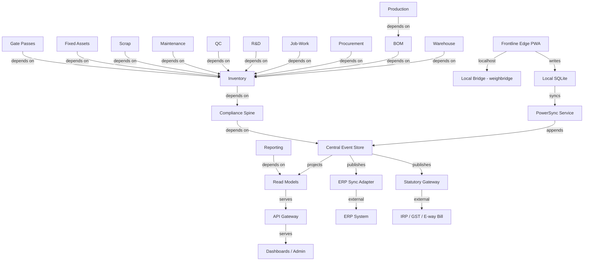

# Architecture Spine — Materials & Supply Chain Management Platform

## Design Paradigm

**Partitioned local-first with central control plane.** The system is a set of independently-operating edge sites (plants, warehouses, R&D stores, hub stores) each with a local-first write path, governed by a central control plane that owns reconciliation, not operation. Every site runs its own instance that works when the network does not. The central plane resolves conflicts by domain rules, never by last-writer-wins.

**Layer mapping:**

| Layer | Namespace | Responsibility |
| --- | --- | --- |
| Frontline Edge | `edge/` | PWA on device; local SQLite; scan-first capture; offline-first write path |
| Sync Layer | `sync/` | PowerSync service; PostgreSQL-to-SQLite replication; upload queue; conflict detection |
| Central Event Store | `events/` | PostgreSQL `domain_events` table; append-only; per-stream optimistic concurrency |
| Read Models | `read/` | PostgreSQL projections; shared across modules; no direct database access from modules |
| Module Domain | `{module}/` | inventory, warehouse, procurement, bom, production, jobwork, research, quality, maintenance, scrap, assets, compliance, gate, reporting |
| Integration Adapters | `adapters/` | ERP sync (dual-mastership), statutory gateway (IRP, GST, e-way bill), IAM/SSO |
| API Gateway | `api/` | REST API v1; SSO-gated; edit-logged for mutating operations |
| Notification Service | `notify/` | Central alert and push delivery; subscribes to read-model projections and event triggers; delivers PWA push, in-app, and email/SMS; owns escalation clocks |

**Dependency direction:**



**The rule:** the edge never calls the central plane directly. It writes to local SQLite. PowerSync moves the data. The central plane never calls the edge. It reads from the event stream. The ERP adapter is the only component that communicates with the external ERP — outbound for BOM structure, inbound for cost rates. No other component touches the ERP. No circular dependencies.

## Invariants & Rules

### AD-1 — Partitioned Local-First Paradigm

- **Binds:** all modules, all edge devices
- **Prevents:** a monolith that requires network connectivity for frontline operations; a microservice tangle where every service calls every other
- **Rule:** every site operates its own local-first write path. The edge device writes to local SQLite, not the central API. The central plane is the reconciliation authority, not the operational authority. The degraded state is visible on the device ("captured, pending sync"). [ADOPTED]

### AD-2 — Gate-Token Event Chain

- **Binds:** gate, weighbridge, receiving, putaway
- **Prevents:** disconnected gate and weighbridge events that cannot be correlated; duplicate tracking of the same physical movement
- **Rule:** every inbound event chain starts with a gate event that creates a vehicle-to-PO binding token. Every subsequent event (weighbridge, receiving, putaway) references the token. The central plane stitches events by token, not by timestamp. [ADOPTED]

### AD-3 — DOA Registry as Single Approval Resolver

- **Binds:** all approval workflows (procurement, disposal, gate passes, production overrides, QC dispositions)
- **Prevents:** hard-coded role assignments in workflow code; conflicting approval paths across modules
- **Rule:** one enterprise DOA registry (role, transaction type, value band, vacation delegation, change audit) resolves approvers for every workflow. Workflow configuration consumes the registry, never overrides it. [ADOPTED]

### AD-4 — BOM as System of Record for Structure

- **Binds:** BOM module, ERP integration, production orders, job-work kits
- **Prevents:** ERP overwriting BOM structure; two conflicting sources of truth for what a product contains
- **Rule:** the BOM module is the system of record for BOM structure. INT-ERP-01 sync is outbound-only for structure. ERP supplies cost rates inbound only. Inbound conflicts create BOM Administrator exceptions, never overwrites. [ADOPTED]

### AD-5 — Production WIP Distinct from R&D Project WIP

- **Binds:** production, R&D, financial compliance
- **Prevents:** co-mingled WIP ledgers that make Ind AS 38 research-vs-development classification impossible; production cost leaking into R&D capitalization
- **Rule:** production WIP (FR-MO-05) and R&D project WIP (FR-RD-07) are separate ledgers with separate stream types. A single transaction cannot post to both. The financial compliance module enforces the separation at the event level. [ADOPTED]

### AD-6 — Custody Ledger Non-Valuated and Segregated

- **Binds:** job-work module
- **Prevents:** customer-owned material appearing in owned inventory valuation; double-counting stock that belongs to the customer
- **Rule:** customer-owned stock lives in a non-valuated, segregated stock class. The custody ledger (FR-JW-05) is a separate stream type. No job-work order can close while its custody ledger balance is non-zero. [ADOPTED]

### AD-7 — R&D Stock Flagged and Blocked from Cross-Issue

- **Binds:** R&D module, inventory module
- **Prevents:** R&D-designated stock being issued to production without approved reclassification; untracked R&D consumption creating audit exposure
- **Rule:** R&D-designated stock carries a flag that blocks cross-issue between R&D and production. Reclassification requires an approved workflow with R&D-head authorization. The flag is enforced at the write path. [ADOPTED]

### AD-8 — Calibration Lockout Non-Overridable

- **Binds:** QC module, maintenance module
- **Prevents:** QC results captured against out-of-calibration instruments; a role-based override that defeats the lockout
- **Rule:** when a QC result is submitted, the write handler checks the calibration status projection from the maintenance event stream. If the instrument is out of calibration, the write is rejected with error code `CALIBRATION_LOCKOUT`. No role can override this rejection. Escalation expedites calibration, never bypasses the lockout. [ADOPTED]

### AD-9 — One Asset Register for Everything

- **Binds:** maintenance module, tooling, fixed assets, R&D equipment custody
- **Prevents:** duplicate asset records across maintenance, tool crib, and fixed assets; a tool that exists in three places with three different statuses
- **Rule:** one maintainable asset register (FR-M-01) covers all physical assets — from a two-tonne mould to a hub screwdriver. The fixed-asset link is optional. Tool crib masters cross-reference the asset register. Equipment custody (FR-RD-06) references the same register. [ADOPTED]

### AD-10 — Source-Linked Scrap Intake Only

- **Binds:** scrap module
- **Prevents:** scrap appearing in the system without traceability to its origin; pilferage disguised as scrap
- **Rule:** every scrap receipt must originate from a source document (production scrap, QC rejection, obsolescence, teardown, replaced parts, retired assets). Intake without a source document is blocked. The source document ID is carried in the event payload. [ADOPTED]

### AD-11 — Asset Subledger Posts to ERP GL

- **Binds:** fixed assets module, ERP integration, financial compliance
- **Prevents:** two conflicting depreciation calculations; the platform and ERP diverging on asset values
- **Rule:** the platform is the operational asset subledger. The ERP GL is the book of record. Depreciation runs produce previews approved before posting to ERP. The platform does not replace the ERP GL. [ADOPTED]

### AD-12 — Compliance Spine as Platform Layer

- **Binds:** all modules
- **Prevents:** compliance rules scattered across modules with inconsistent enforcement; modules that can be deployed without the compliance layer
- **Rule:** the compliance spine (edit log, DOA registry, business-stream tagging, event-sourced location, calibration lockout, statutory document triggers) is the bottom layer of the dependency graph. Every module depends on it. It is built and acceptance-tested before any module lands. No module can bypass the compliance spine. [ADOPTED]

### AD-13 — Nothing Crosses the Gate Without a Document

- **Binds:** gate module, all outbound movements
- **Prevents:** unrecorded material leaving the site; gate events that are not tied to an authorized movement
- **Rule:** every outbound movement that is not a sales dispatch, job-work challan, or scrap dispatch requires a serially numbered gate pass (RGP or NRGP). The gate enforcement check at exit validates the pass. No matching open gate pass, no exit. Mismatches raise incidents. [ADOPTED]

### AD-14 — Read Models are Shared Projections

- **Binds:** all modules, reporting module
- **Prevents:** modules directly querying each other's event streams; read-side coupling that makes module replacement impossible
- **Rule:** read models are PostgreSQL projections built from the event stream. Modules read from shared projections, not from each other's event streams. The reporting module reads from projections, never from the event store directly. No module has direct database access to another module's tables. [ADOPTED]

### AD-15 — Event-Sourced Location with Asserted-vs-Expected

- **Binds:** all stock movements, gate events, putaway events
- **Prevents:** stock appearing at a location without the system knowing how it got there; "last-writer-wins" location updates that silently overwrite discrepancies
- **Rule:** every stock movement event carries an `asserted_location` (where the operator says it is). The system computes an `expected_location` (where it should be based on prior events). A mismatch is an exception, not a silent overwrite. The location tracking is event-sourced — the current location is a projection, not a mutable column. [ADOPTED]

### AD-16 — Idempotency Keys on All Edge-Originated Commands

- **Binds:** all edge devices, central event store
- **Prevents:** duplicate events from multiple devices capturing the same physical fact; double-counting stock movements
- **Rule:** every command that can be issued from multiple devices carries an `idempotency_key` — the task ID or source document ID. The central plane deduplicates by `idempotency_key`. A duplicate submission returns HTTP 409 with the existing event ID. The stock balance is updated exactly once. [ADOPTED]

### AD-17 - Notification Emission Coupling Is the Caller's Explicit Choice

- **Binds:** every module that emits notifications, notification foundation (`src/notify/`)
- **Prevents:** a notification-emission failure aborting a business write that already succeeded; business-critical decisions committing without the notification record that is part of the decision itself
- **Rule:** modules emit through exactly two entry points. `emitNotification()` is the default: decoupled, never throws, never joins the caller's transaction (Story 1.11 AC4). `emitNotificationInTransaction()` is the transactional-outbox opt-in: the notification event commits atomically with the caller's business write. Flows where the notification is part of the business fact (approval and rejection decisions, DOA delegation notices, statutory communications) MUST use the transactional entry point. Full decision record, consequences, and dissent: [ADR-001](../../../../docs/adr/ADR-001-notification-emission-coupling.md). [ADOPTED]

## Consistency Conventions

| Concern | Convention |
| --- | --- |
| Naming (entities) | Singular — `stock_movement`, not `stock_movements` |
| Naming (events) | Past-tense, dot-separated — `gate.entered`, `stock.allocated`, `bom.released` |
| Naming (commands) | Imperative PascalCase — `EnterGate`, `AllocateStock`, `ReleaseBom` |
| Naming (files) | Module name, no abbreviations except glossary terms — `inventory/`, `bom/`, `maintenance/` |
| IDs (internal) | UUIDv4 for all internal entity identifiers |
| IDs (external) | Validated strings stored in `_ext` suffixed fields — `supplier_gstin_ext`, `challan_number_ext` |
| Dates | All timestamps UTC with timezone in storage. `business_date` is a separate IST date field for statutory purposes |
| Error shapes | Uniform envelope: `{ error_code, message, details, trace_id }`. `error_code` is a stable string; frontend maps to localized messages |
| State mutation | Only through events. No mutable columns for domain state. Current state is a projection |
| Logging | Every mutating API request logged to the edit log with `trace_id` |
| Auth | SSO (SAML 2.0/OIDC) via IAM gateway. RBAC to module, function, location, and data level |
| Config | Workflow rules, retention classes, statutory thresholds as dated configuration files, not hard-coded |
| Frontend standards | WCAG 2.1 AA conformance for every UI surface (NFR-U-02/03); i18n via the stable `error_code` → localized-message mapping plus per-locale resource files — no hard-coded user-facing strings |

## Stack

| Name | Version | Role |
| --- | --- | --- |
| Node.js | 24 LTS (Krypton) | Runtime |
| PostgreSQL | 18.4 (self-managed) | Event store + read models |
| PowerSync | Service 1.23.x (self-hosted, Docker) | Edge sync engine |
| Next.js | 16 (self-hosted: `output: 'standalone'` + Docker) | Frontend PWA + control-plane BFF |
| TypeScript | 5.x | Language |
| Docker + Docker Compose | latest stable | Container runtime / orchestration |
| nginx or Caddy | latest stable | Reverse proxy + TLS termination |
| pgBackRest (or equivalent) | latest stable | WAL archiving + base backups (RPO 1h) |

**Frontend framework decision (pinned 2026-07-12):** **Next.js 16** — chosen over TanStack Start for a 36-month compliance-critical build: mature ecosystem, first-class PWA/offline support, documented PowerSync integration, and clean self-hosting on a native server / VPS via standalone output behind a reverse proxy. This closes the readiness finding UX-1.

**Deployment-portability rule (conditioning principle):** No component may depend on a cloud-vendor-proprietary managed service. The stack is standard PostgreSQL, self-hostable PowerSync, and a containerized Node runtime, so the identical image set runs on a **native server, a cloud VPS, or (optionally) a managed-cloud profile** without code change. This is consistent with the PRD OQ1 principle ("no region-bound assumptions hard-coded in the data layer").

## Structural Seed

```text
{root}/
  edge/                    # PWA — offline-first frontline capture
    src/
      capture/             # gate, weighbridge, putaway, indent flows
      sync/                # PowerSync client integration
      local-db/            # SQLite schema and migrations
  sync/                    # PowerSync service configuration and sync rules
  events/                  # Central event store schema and migrations
    domain_events.sql      # Single table with per-stream optimistic concurrency
  read/                    # Read model projections
    projections/           # Per-module projection definitions
  inventory/               # Core inventory module
  warehouse/               # Warehouse operations module
  procurement/             # Procurement and tendering module
  bom/                     # BOM and engineering change module
  production/              # Production orders and WIP module
  jobwork/                 # Job-work services module
  research/                # R&D and maker-hub module
  quality/                 # Quality control module
  maintenance/             # Maintenance, calibration, and tooling module
  scrap/                   # Scrap, defectives, and disposal module
  assets/                  # Fixed assets and intangibles module
  compliance/              # Financial compliance spine
  gate/                    # Gate passes and returnable materials module
  reporting/               # Reporting and analytics module
  notify/                  # Notification service — push, alerts, escalation clocks
  adapters/                # External integration adapters
    erp/                   # ERP dual-mastership sync
    statutory/             # IRP, GST, e-way bill gateway
    iam/                   # SSO and SCIM provisioning
  api/                     # REST API gateway
    v1/                    # Versioned API endpoints
  deploy/                  # Infrastructure as code (vendor-neutral)
    compose/               # Docker Compose stacks (app, PowerSync, Postgres, proxy)
    provision/             # Host provisioning IaC — native server / cloud VPS
    backup/                # pgBackRest / WAL-archive config
```

## Capability → Architecture Map

| Capability / Area | FR IDs | Lives in | Governed by |
| --- | --- | --- | --- |
| Core Inventory | FR-I-01–FR-I-10 | `inventory/` | AD-1, AD-14, AD-15 |
| Warehouse Operations | FR-W-01–FR-W-09 | `warehouse/` | AD-1, AD-2, AD-14 |
| Procurement | FR-P-01–FR-P-09 | `procurement/` | AD-3, AD-14 |
| Tender Management | FR-T-01–FR-T-07 | `procurement/` | AD-3, AD-14 |
| Order Management | FR-O-01–FR-O-08 | `inventory/` | AD-1, AD-14 |
| Demand Planning | FR-D-01–FR-D-08 | `inventory/` | AD-1, AD-14 |
| Logistics | FR-L-01–FR-L-08 | `inventory/` | AD-1, AD-14 |
| R&D & Maker-Hub | FR-RD-01–FR-RD-20 | `research/` | AD-5, AD-7, AD-9, AD-14 |
| BOM & ECO | FR-B-01–FR-B-17 | `bom/` | AD-4, AD-14 |
| Production Orders | FR-MO-01–FR-MO-13 | `production/` | AD-5, AD-14 |
| Job-Work Services | FR-JW-01–FR-JW-15 | `jobwork/` | AD-6, AD-14 |
| Quality Control | FR-Q-01–FR-Q-15 | `quality/` | AD-8, AD-14 |
| Maintenance | FR-M-01–FR-M-18 | `maintenance/` | AD-8, AD-9, AD-14 |
| Tooling | FR-TL-01–FR-TL-17 | `maintenance/` | AD-9, AD-14 |
| Scrap & Disposal | FR-SC-01–FR-SC-22 | `scrap/` | AD-3, AD-10, AD-14 |
| Fixed Assets | FR-FA-01–FR-FA-20 | `assets/` | AD-9, AD-11, AD-14 |
| Financial Compliance | FR-AC-01–FR-AC-16 | `compliance/` | AD-3, AD-5, AD-12, AD-14 |
| Imports | FR-IM-01–FR-IM-09 | `compliance/` | AD-12, AD-14 |
| Budget Control | FR-BC-01–FR-BC-02 | `compliance/` | AD-3, AD-12, AD-14 |
| DOA Registry | FR-DOA-01 | `compliance/` | AD-3, AD-12 |
| Gate Passes | FR-GP-01–FR-GP-14 | `gate/` | AD-2, AD-13, AD-14 |
| Reporting | FR-R-01–FR-R-08 | `reporting/` | AD-14 |
| Notifications & Alerts | FR-P-04/UJ-IND-01 (push-notified indent decisions), FR-M-04 (fault alerts), FR-GP-09/FR-GP-10 + FR-JW-14 (escalating overdue clocks) | `notify/` | AD-14 |
| Event Envelope | all | `events/` | AD-16 |
| Offline Sync | all edge | `edge/`, `sync/` | AD-1, AD-16 |

## Event Envelope

Every event in the system — edge or central — carries the following shape:

| Field | Type | Description |
| --- | --- | --- |
| `event_id` | UUID | Globally unique |
| `stream_type` | string | Aggregate type — `inventory`, `bom`, `maintenance`, `qc`, `gate`, etc. |
| `stream_id` | UUID | Aggregate instance this event belongs to |
| `event_type` | string | Dot-separated past-tense — `gate.entered`, `stock.allocated` |
| `event_version` | integer | Per-stream monotonic sequence |
| `payload` | JSONB | Domain-specific, versioned, validated against schema |
| `metadata.correlation_id` | UUID | Links events across streams (e.g., the gate token) |
| `metadata.causation_id` | UUID | The event that caused this one |
| `metadata.actor` | object | `{ user_id, role, location_id }` |
| `metadata.device_id` | string | Required for edge-originated events; null for central-plane events |
| `metadata.capture_method` | enum | `AUTO` or `MANUAL` |
| `metadata.occurred_at` | timestamptz | UTC |
| `metadata.synced_at` | timestamptz | Null until central plane receives it |
| `schema_version` | integer | For upcasting; starts at 1 |

## Deployment Topology

**Primary profile — native server or cloud VPS (self-hosted, vendor-neutral):**

| Environment | Target | Infrastructure |
| --- | --- | --- |
| Production | Native server or cloud VPS (single node, or clustered for HA) | Dockerized containers (Next.js, PowerSync service, projection workers, notify) behind nginx/Caddy TLS; self-managed PostgreSQL 18 primary + streaming-replication standby; WAL archiving via pgBackRest; optional CDN/edge cache in front of static assets |
| DR | Second native server / VPS (separate site or region) | PostgreSQL streaming-replication warm standby + archived WAL; container definitions replicated via IaC; failover target, not an active read replica |
| Staging | Single VPS / native server | Single-node Docker Compose stack; single Postgres instance |
| Development | Local workstation or dev VPS | Docker Compose; no CDN; ephemeral Postgres |

**RTO:** 4 hours. **RPO:** 1 hour — met by streaming replication (near-real-time standby) plus WAL archiving with ≤1h archive cadence and daily base backups (NFR-DI-04). Moving off a managed Multi-AZ database makes these the operator's explicit responsibility: HA = primary+standby with automated failover; backups = pgBackRest to off-host storage.

**Optional alternative profile — managed cloud (if the org later elects it):** the same container images and standard PostgreSQL run unchanged on a managed profile (e.g., managed PostgreSQL + a container service + CDN). This is a deployment choice, not an architecture change — no code depends on it.

**Assumption reconciliation (A-07):** the source assumed "cloud-hosted (SaaS or private cloud), not on-premises." A native-server target may be on-premises or private-cloud; this deployment directive (2026-07-12) supersedes the "not on-premises" leaning of A-07. Data-residency and physical-security controls that a managed cloud would have provided become explicit operator responsibilities on a self-hosted native server.

## Retention Policy

| Data Class | Retention | Storage |
| --- | --- | --- |
| Event store (all streams) | 8 financial years online | PostgreSQL |
| Event store (archived) | Permanent | Object-storage cold/archive tier (S3-compatible or equivalent); restorable to queryable within 48 hours |
| CoA / CoC documents | 7 years | Document store |
| Gate passes | 8 years | Document store |
| GST documents | 8 years | Document store |
| Calibration certificates | Life of instrument + 3 years | Document store |
| DPDP PII | Per consent; crypto-shred on erasure request | Event store with shredding |

## API Contract

| Concern | Convention |
| --- | --- |
| Protocol | REST over HTTPS |
| Versioning | URL-prefixed - `/api/v1/` |
| Auth | SSO-gated (SAML 2.0/OIDC); every request authenticated |
| Mutating operations | Logged to edit log with `trace_id` |
| Error envelope | `{ error_code, message, details, trace_id }` |
| Stable error codes | `CALIBRATION_LOCKOUT`, `INSUFFICIENT_STOCK`, `APPROVAL_REQUIRED`, `DUPLICATE_EVENT`, `STREAM_CONFLICT`, `UNTAGGED_TRANSACTION`, `GATE_PASS_REQUIRED`, `SOURCE_DOCUMENT_REQUIRED`, `CROSS_ISSUE_BLOCKED`, `CUSTODY_NOT_ZERO`, `LOT_EXPIRED`, `LOT_ON_HOLD`, `DUPLICATE_LOT`, `DUPLICATE_SERIAL`, `SERIAL_REQUIRED`, `SERIAL_NOT_ALLOWED`, `SERIAL_NOT_AVAILABLE`, `NO_AVAILABLE_LOT`, `LOT_NOT_FOUND`, `LOT_REQUIRED`, `SERIAL_NOT_FOUND`, `ITEM_NOT_FOUND`, `FUNCTION_ACCESS_DENIED`, `LOCATION_ACCESS_DENIED`, `VALUATION_METHOD_NOT_PERMITTED`, `NRV_RECOVERY_EXCEEDS_ORIGINAL_COST` |

## Spine Acceptance Contract

The compliance spine is accepted when these five tests pass against a deployed spine with no modules:

| Test | FR Reference | Verification |
| --- | --- | --- |
| Edit log integrity | FR-AC-13 | Submit events; verify every transaction appears in the edit log; verify the log is append-only; verify auditor-reportable format |
| DOA registry resolution | FR-DOA-01 | Submit approval workflows; verify every workflow resolves approvers from the registry; verify no hard-coded roles bypass the registry |
| Event-sourced location | INT-LOC-01 | Submit stock movement events with asserted locations; verify expected location is computed; verify mismatches are exceptions, not silent overwrites |
| Calibration lockout | FR-M-13 | Submit a QC result referencing an out-of-calibration instrument; verify the write is rejected; verify no role can override the rejection |
| Business-stream tagging | FR-AC-01 | Submit an untagged inventory transaction; verify the write is blocked; verify the rejection message identifies the missing tag |

## Deferred

| Decision | Reason deferred | Revisit condition |
| --- | --- | --- |
| ~~Framework choice (Next.js 16 vs TanStack Start)~~ **DECIDED 2026-07-12: Next.js 16** | — | Resolved (see Stack); the sync layer remains framework-abstracted should it ever need revisiting |
| Build sourcing (in-house, partner, hybrid) | Sponsor decision, not architecture | Before Phase 1 detailed design |
| Pilot site selection | Sponsor decision; Ravi recommends ugliest-site-first | Before first go-live planning |
| Budget envelope | Sponsor + finance decision | Before Phase 1 commitment |
| Detailed per-module schema | Code owns the detail; the spine fixes invariants, not columns | During module story implementation |
| GraphQL vs REST for reporting queries | REST is the default; GraphQL for ad-hoc reporting may be added later | During reporting module design |
| Meter ingestion automation (INT-MTR-01) | Phase 2; operator-entered readings acceptable for Phase 1 | Phase 2 planning |
| EPR portal automation (INT-EPR-01) | Phase 2; manual upload acceptable for Phase 1 | Phase 2 planning |
| Phase-1 outbound demand source (decision D1) | Resolved in epics (Story 2.9): Phase-1 outbound demand is served by an ERP sales-order projection plus an open-PO inbound reference projection; native order capture (FR-O) remains Phase 2 (Epic 15) | Closed — revisit only if Epic 15 order capture is pulled forward |